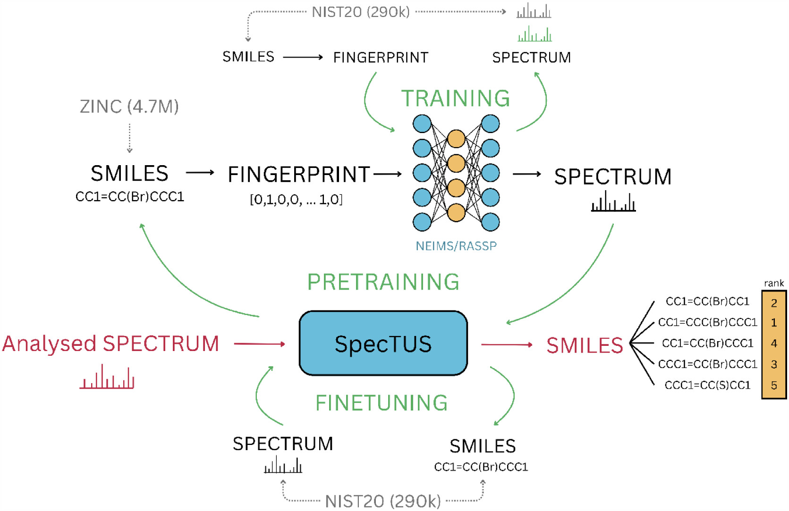

# SpecTUS: Spectral Translator for Unknown Structures annotation from EI-MS spectra

[](https://doi.org/10.1021/acs.analchem.6c02423)
[](https://arxiv.org/abs/2304.01634)
[](https://huggingface.co/MS-ML)

**SpecTUS** is a transformer-based tool for reconstructing Gas Chromatography-Electron Ionization (GC-EI) mass spectra. The model reconstructs spectra in a de novo manner — directly translating the spectra into 2D molecular structures represented as SMILES strings. The model is pretrained on a large dataset of synthetic spectra and fine-tuned on a smaller dataset of experimental NIST20 spectra. The NIST20 is a proprietary dataset; therefore, we cannot share the final model, but the code for training the model is carefully documented and available for public use. If you own a license for the NIST20 dataset, you can train the model yourself.

We make freely available the 17.2M synthetic spectra used for pretraining the model and the checkpoint of the pretrained model that
can be further finetuned on your own dataset [here](https://huggingface.co/MS-ML).

## 📄 Paper
SpecTUS is published in **_Analytical Chemistry_** (ACS, 2026):
[**SpecTUS: Spectral Translator for Unknown Structures Annotation from EI-MS Spectra**](https://pubs.acs.org/doi/10.1021/acs.analchem.6c02423) — DOI [10.1021/acs.analchem.6c02423](https://doi.org/10.1021/acs.analchem.6c02423).

## 📝 Abstract
Compound identification and structure annotation from mass spectra are essential in drug detection, forensics, and small molecule discovery. Current approaches to compound identification from electron ionization mass spectra (EI-MS) are dependent on different forms of searching databases that are orders of magnitude smaller than the space of potential molecular structures they attempt to cover. We introduce SpecTUS: Spectral Translator for Unknown Structures, a deep learning model for de novo structural annotation, translating gas chromatography EI-MS spectra directly into molecular structures without requiring reference databases. This enables the identification of novel compounds absent from spectral libraries. In a rigorous evaluation, SpecTUS significantly outperformed standard database search techniques. On a held-out test set of 28,267 spectra from NIST 20, the model’s single suggestion perfectly reconstructed 43% of the subset’s compounds. On 76% of this test set, the single suggestion is strictly better, in terms of Tanimoto similarity of Morgan fingerprint, than the result of hybrid database search. With ten suggestions, SpecTUS achieved 65% perfect reconstructions, surpassing hybrid search on 84% of the test set.

<p align="center">
  
</p>

<p align="center"><em>Spectra generators (NEIMS/RASSP), trained on NIST20, produce synthetic spectra from ZINC molecules for pretraining. SpecTUS is then finetuned on NIST20 and, at inference, translates an analysed EI-MS spectrum directly into ranked SMILES candidates.</em></p>

## 🎮 Demo 
You can run a demo inference of the final model hosted on our server via Jupyter Notebook in [this](https://github.com/ljocha/spectus-demo) repository.

## 📁 Repository Structure
```
SpecTUS/
├── config_runners/          # Shell scripts for model training, evaluation, and prediction, model comparison
├── configs/                 # YAML configuration files for model training, evaluation, prediction, model comparison
├── data/                    # Includes used NIST splits, example data, and synthetic data
├── forward/                 # Scripts for spectra generators (NEIMS, RASSP) training
├── notebooks/               # Jupyter notebooks for data preprocessing, pretraining, finetuning, hyperparameter search, model evaluation, and comparison of the models
├── predictions/             # Test predictions of all models (hyperparameter search) and database search methods (HSS, SSS, BDC) mentioned in the paper
```

## 🛠 Installation
1. Clone the repository:
   ```bash
   git clone https://github.com/hejjack/SpecTUS.git
   cd SpecTUS
   ```
2. Set up the Python environment:
   ```bash
   conda env create -f trainSpectus_build.yaml
   ```

## 🚦 Usage
Data preprocessing, pretraining, finetuning, hyperparameter search, model evaluation, and comparison of the models are all described step by step in the [notebooks/](notebooks/).

An example notebook for [inference](notebooks/5_inference_on_open_data.ipynb) is available to help you get started reconstructing spectra from an `msp` file once you have your model trained.

## 📄 Citation
If you use **SpecTUS** in your research, please cite our paper published in *Analytical Chemistry*:
```
@article{hájek2026spectus,
      title={SpecTUS: Spectral Translator for Unknown Structures Annotation from EI-MS Spectra},
      author={Hájek, Adam and Starý, Michal and Price, Elliott and Jozefov, Filip and Hecht, Helge and Křenek, Aleš},
      journal={Analytical Chemistry},
      year={2026},
      publisher={American Chemical Society},
      doi={10.1021/acs.analchem.6c02423},
      url={https://pubs.acs.org/doi/10.1021/acs.analchem.6c02423},
}
```

